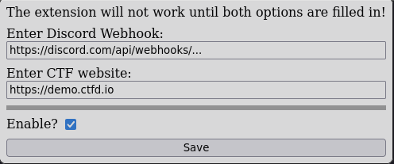

# FlagVault

An alternative version that works on most CTF websites.

# Installation

Download the extension file from the [releases page](https://github.com/certificateofparticipation/FlagVault/releases).

On Firefox:
- Accept warning(s)

# Setup

After installing, open the extension's config menu.

Enter your discord webhook URL and the CTF website.
- `https://` and `/` will be added to the start and removed from the end of the target website respectively.

# Usage

Just submit a flag on the target CTF website! 

Your submission will not go through, and the relevant challenge title and your submission will be sent to your discord channel.

When your team is ready to submit, you can turn off the extension through the checkbox in the config menu.

Good luck :)
