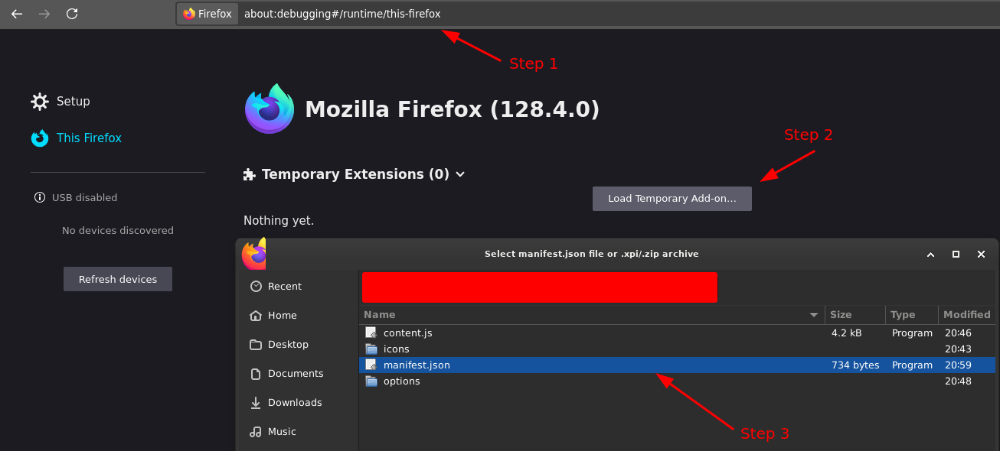
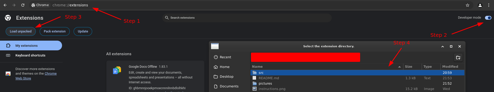
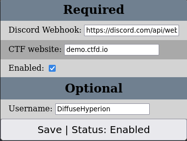
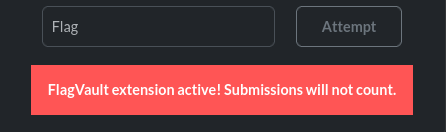

# FlagVault

## SECRET!!! DO NOT LEAK

A browser extension to automatically flag hoard on CTFd websites.

When active, all submissions of answers will be sent to a discord webhook of your choice.

# Installation
1. [Download]((https://github.com/certificateofparticipation/FlagVault/archive/refs/heads/master.zip)) and unzip the source code of this repository.
2. Depending on your browser:
   1. Firefox:
      1. Visit `about:debugging#/runtime/this-firefox`
      2. Click on `Load Temporary Add-On...`
      3. Select `src/manifest.json`
      
   2. Chrome:
      1. Visit `chrome://extensions/`
      2. Turn on `Developer Mode`
      3. Click on `Load unpacked`
      4. Select `src`
      
      5. Ignore the error that pops up (dumb chrome compatability issues)

# Setup

After installing, open the extension's config menu.

Enter your discord webhook URL and the CTF website.

Optionally, add a username to mark your attempts in sent discord messages.

If everything is set up correctly, the save button should say `Status: Enabled`

# Usage

When the extension is active, a banner will pop up at the bottom of your challenge inputs.

**If there is no banner, the extension is not active, and submissions will reach the CTF server!**

If the extension is active, just submit a flag on the target CTF website! 

Your submission will not go through, and the relevant challenge title and your submission will be sent to your discord channel.

When your team is ready to submit, you can turn off the extension through the checkbox in the config menu.

Good luck :)
